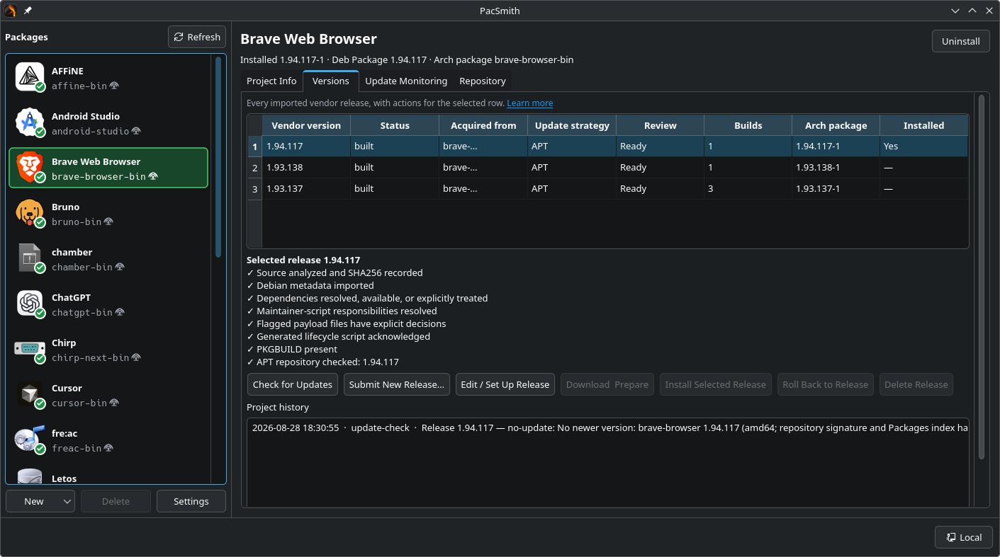

<p align="center">
  
</p>

# PacSmith

### Install and manage `.deb`, `.rpm`, and other upstream Linux packages as native Arch Linux packages, without the AUR.

- **Automated updates** from upstream releases
- **Painless distribution** through the included signed pacman repository
- **Manage from anywhere**, locally or over the network from multiple machines
- **AI-native management**, either completely through an AI agent or completely manually
- **Build once, install everywhere**, compiling source packages once and distributing them as binaries
- **Safer source builds** in isolated, rootless containers
- **Use it your way** through the GUI, CLI, or MCP + Skill

<p align="center">
  
</p>

PacSmith takes the packages developers actually publish, including Debian `.deb` files, RPMs, AppImages, archives, and related artifacts, and converts them into ordinary pacman packages that you can install, update, and remove like anything else on the system. A PacSmith library can also publish those builds through its own signed pacman repository for other Arch machines.

It is not an AUR helper. It does not download community PKGBUILDs. You import the developer's own packages, review the generated recipe, and become the package maintainer. The point is a shorter trust chain: developer → you, with no extra packager in the middle.

## Install and get started

### Install PacSmith

Download the newest `pacsmith-*.pkg.tar.zst` and its `SHA256SUMS` file from [GitHub Releases](https://github.com/anderson-arlen/PacSmith/releases). From a directory containing only that PacSmith package and checksum file, verify the download and install it with pacman:

```bash
sha256sum -c SHA256SUMS
sudo pacman -U ./pacsmith-*.pkg.tar.zst
```

PacSmith includes its GUI, CLI, user daemon, Agent Skill, and MCP server. Launch the GUI with `pacsmith-gui`. The GUI, a library-using CLI command, or `pacsmith mcp` starts the local user daemon automatically, so an MCP harness does not require the GUI to be opened first. A client configured for a remote library connects to that server instead.

### Connect an AI harness

Install the bundled PacSmith Skill for your user:

```bash
pacsmith skill install
```

This installs the Skill at `~/.agents/skills/pacsmith` for harnesses that discover shared Agent Skills. Restart or reload the harness if it was already running. `pacsmith skill path` prints the active Skill path, and `pacsmith plugin path` prints the complete portable Agent Plugin containing both the Skill and MCP declaration.

Register PacSmith's local stdio MCP server in the harnesses you use:

- **[Codex](https://developers.openai.com/codex/mcp/):** `codex mcp add pacsmith -- pacsmith mcp`
- **[Claude Code](https://code.claude.com/docs/en/mcp):** `claude mcp add --scope user --transport stdio pacsmith -- pacsmith mcp`
- **[Gemini CLI](https://geminicli.com/docs/tools/mcp-server/):** `gemini mcp add --scope user pacsmith pacsmith mcp`
- **[Cursor](https://cursor.com/docs/mcp):** add the following entry to the `mcpServers` object in `~/.cursor/mcp.json`:

```json
{
  "mcpServers": {
    "pacsmith": {
      "type": "stdio",
      "command": "pacsmith",
      "args": ["mcp"]
    }
  }
}
```

If the harness supports Agent Plugins 1.0 directly, you can instead give its plugin installer the directory printed by `pacsmith plugin path`. Review and approve the MCP tools when the harness asks.

PacSmith can also launch your harness from contextual **Ask AI** buttons in the GUI. After MCP is connected, send this prompt to the harness once:

> Install yourself as the default pacsmith AI harness

This launch profile is separate from MCP registration. It tells PacSmith how to open the harness with project and release context when you choose **Ask AI**. Terminal-based harnesses are opened inside a visible terminal emulator.

## Quick start

### Use the GUI

Open `pacsmith-gui`, choose **New**, and import an official vendor package file, direct download, GitHub project, or signed APT/RPM repository. Review the detected metadata, dependencies, scripts, payload decisions, desktop integration, and generated PKGBUILD. When the review is clear, build and install the resulting native package. Configure update monitoring to keep the project current from the same upstream source.

### Use an AI agent

With the PacSmith Skill installed and MCP connected, just ask your agent:

> What's the best way to install X on this machine?

The agent can weigh the available options and suggest PacSmith when it is a good fit. If it does, tell it to “set it up.” It can add and configure the project, build the native Arch package, and install it without you ever opening the GUI. Elevated privileges are needed only for the final pacman installation. PacSmith requests them through polkit, which asks you for your password directly, so the agent never has access to it.

The GUI and agent stay synchronized through the same server-owned library, so you can begin a project in one and continue in the other.

## Why PacSmith

Arch Linux is excellent at what it ships in the official repositories. Third-party application support outside those repos is another story. The Arch User Repository exists to fill that gap, and for years it has been the default answer to "how do I install this on Arch?" It has real problems.

### You have to trust a stranger

Installing software always requires some trust in the people who wrote it. The AUR adds a second, often invisible, party: the package maintainer.

A typical AUR package is not the developer's release. It is a community PKGBUILD that downloads, unpacks, and installs that release. The person who wrote that recipe is usually not the software author. You do not know them. If they later walk away, someone else can adopt the package and inherit the name, the history, and the trust that accumulated around it.

PacSmith removes that extra person from the chain. You import the developer's package yourself, inspect it, generate the PKGBUILD, and keep the project. The only maintainer you have to trust is you. When useful, your existing AI harness can assist through PacSmith's standards-based MCP tools and Agent Skill.

### The AUR has become a malware target

That extra-maintainer model is not a theoretical weakness. It is how recent AUR attacks actually worked.

In June 2026, a campaign later called **Atomic Arch** showed how cheap it is to buy existing trust. Attackers did not need to break into Arch's official repositories. They adopted abandoned AUR packages — a normal, documented process — and rewrote the PKGBUILDs. The first wave injected a malicious npm package during install. When that was noticed, they switched delivery methods within a day. Community tracking put the total above 1,500 packages. The payload was a credential stealer aimed at SSH keys, browser data, cloud tokens, password managers, and crypto wallets, with an eBPF rootkit available to hide on compromised machines.

That was not the last wave. In late July and August 2026 another campaign hit, again through compromised maintainers and orphaned-package adoption. A loader installed a Tor client, fetched a second-stage payload from an onion service, then delivered a Rust infostealer with remote-access and SSH-worm behavior. Fairly popular packages were among those reported. Arch's response escalated from disabling new AUR account registrations, to freezing package adoption, to blocking AUR pushes entirely while the mess was cleaned up.

None of this required a novel exploit in pacman. The AUR's trust model *is* the attack surface: recipes from people you do not know, attached to package names users already recognize. Similar orphaned-package takeovers go back years. 2026 simply made the scale impossible to ignore.

If you install from the AUR, you are not only trusting the application developer. You are trusting whoever currently controls that PKGBUILD.

### Updates depend on that same extra party

Trust is only half of the problem. The other half is time.

Once you rely on an AUR package, you also rely on that maintainer to notice upstream releases, update the recipe, and push. Developers ship; the AUR lags. Packages go stale. Maintainers disappear. Orphans sit with a trusted name until someone — possibly not a volunteer you would choose — picks them up.

### The AUR also does not have everything

Even a healthy AUR is incomplete. New applications, niche tools, and Linux builds that only the developer publishes often have no AUR package yet. Waiting for a volunteer to appear puts you back in the same trust-and-latency situation. PacSmith is for those cases too: if the developer publishes a Debian package, RPM, AppImage, GitHub release, or similar artifact, you can turn it into a local Arch package without waiting for the AUR to catch up.

### Flathub is decent. It is still someone else's repo

Flatpak, and Flathub in particular, is a reasonable answer for a lot of desktop software. The distribution model is cleaner than the AUR, updates come from a real repository, and the sandbox is a genuine security feature when it is actually used.

You are still trusting a third party. The application on Flathub is packaged, reviewed, and shipped by people who are usually not the developer. That is a better-run extra party than a random AUR maintainer, but it is the same kind of extra party: another org in the trust chain, another place a recipe or manifest can drift from what the developer published.

The sandbox also helps less often than the marketing implies. Flatpak permissions are powerful when they are tight. In practice, a large share of popular apps request far more than they need: full home-directory access, host filesystem access, unfiltered network, device nodes, and so on. Once an app can read `$HOME` and talk to the network, a lot of the isolation is already gone. You still get some benefits — a separate runtime, cleaner uninstall — but you should not treat "it is a Flatpak" as equivalent to "it is confined."

PacSmith's bet is different. Take the developer's own package, make it a pacman package you control, and keep the update channel pointed at the developer. No Flathub maintainer, no AUR PKGBUILD, and no sandbox you have to pretend is tighter than the permissions on the app.

## What PacSmith is

PacSmith is a conversion wizard from foreign Linux artifacts into pacman-managed installs.

You point it at a `.deb`, RPM, AppImage, Arch package, tar/zip archive, or standalone executable — from a local file, a direct HTTPS URL, a signed APT or RPM repository, or a GitHub release. GitHub URLs go directly to `pacsmithd`, which uses its server-owned token to resolve and download the release without exposing the credential or routing the artifact through a remote client. PacSmith inspects the artifact as data, without executing it. It extracts metadata, dependencies, desktop entries, icons, payload layout, and (for DEB/RPM) maintainer scripts as review evidence. It then generates an editable PKGBUILD. Foreign install scripts and dependency mapping can be reviewed manually or interactively with an external AI harness through MCP.

From there the workbench walks you through ordinary Arch packaging:

1. Review what the developer shipped.
2. Map dependencies, commands, desktop files, and anything suspicious, optionally with an external agent using the same controls through MCP.
3. Build with `makepkg` as your normal user.
4. Install with a narrowly scoped `pkexec pacman -U`.
5. Optionally publish the signed build through your library's pacman channels.
6. Uninstall or roll back later through pacman, because the result is a real package, not a pile of files in `/opt` that you will forget about.

The last step is the point of using pacman at all. Third-party Linux software is often distributed as an AppImage, a tarball, or a Debian package "you can just extract." Those leave you with ad-hoc files, leftover systemd units, and no clean inverse operation. PacSmith's output is a pacman package, so the application shows up in the package database and comes off the system the same way official packages do.

### Updates are the feature that actually matters

Creating a one-off PKGBUILD from a developer's `.deb` or RPM is not why this app exists. Nobody would go to that trouble if the next release meant doing it again by hand. Keeping the package current, without handing the job back to an AUR maintainer, is the part most Arch users do not have a good answer for.

PacSmith is the update authority for the packages it creates. After import, each project has an update configuration. You can watch:

- **Signed Debian/Ubuntu APT repositories** — the same developer channel the `.deb` originally came from
- **Signed RPM / Red Hat-style repositories** — Fedora, RHEL, OpenSUSE, and the developer's own Yum/DNF repos
- **GitHub Releases** — tagged assets from the developer's repository, including cases where there is no Linux package repo at all.

When a newer upstream version appears, PacSmith can notify you, optionally download and inspect it, and walk you through a new release of *your* package. Your reviewed Guided choices carry forward across same-format updates. A Custom PKGBUILD and its support files copy forward verbatim while PacSmith regenerates `pacsmith.vars` for the new verified artifact. Discovery and preparation remain deterministic. Per project, the subsequent build can be disabled or allowed when deterministic review is clear; evidence requiring judgment remains prepared for an external harness instead of giving the daemon model credentials.

Vendors that publish behind an interactive download page or have no machine-readable release channel can use Manual monitoring. On the Versions tab, **Submit New Release** accepts either a locally downloaded vendor artifact or its direct HTTPS URL, an explicit version when the artifact does not identify itself, and an optional publisher SHA-256. PacSmith verifies a supplied checksum during the download and again at the server import boundary. The artifact then follows the same inspection, configuration carry-forward, review, build, and repository workflow as an automatically discovered release. A submitted URL records acquisition provenance without changing Manual monitoring into Direct URL monitoring.

That is the difference between "I converted a `.deb` once" and "I can actually live without the AUR." The first is a weekend script. The second is why PacSmith exists.

Update checks can run on demand or on a systemd user timer. An optional tray helper badges available updates. One retention setting chooses how many completed versions to keep behind each package's oldest active distribution pointer. Stable is the boundary when it has a published version; otherwise Unstable is. PacSmith cleans up each excess older version's source artifact and built packages together while preserving the entire Stable-to-Unstable rollout window. Repository HTTP listening does not control these internal pointers.

### Bring your own AI harness

PacSmith is not an AI client. It has no provider login, API-key setting, model picker, conversation window, transcript store, screenshot handling, or web search. Conversations happen in the user's chosen harness. PacSmith contributes a portable Agent Plugins 1.0 bundle containing both standards-based pieces:

- `pacsmith mcp` runs a stdio MCP server using the exact same configured local Unix-socket or remote HTTPS/mTLS library connection as the CLI and GUI.
- `pacsmith plugin path` prints the Agent Plugin directory containing `plugin.json`, `mcp.json`, and the PacSmith Agent Skill.
- `pacsmith skill install` also copies the Skill into the cross-harness user directory `~/.agents/skills/pacsmith` for clients that discover standalone Skills; `pacsmith skill path` prints the active Skill directory.

`make install` installs the bundle and the shared standalone Skill. A Skill is guidance, not permission to execute an MCP server. Agents prefer MCP when it is available and may use documented PacSmith CLI commands when it is not. If a task needs MCP-only functionality, the agent asks whether you want the integration installed; after approval, the harness uses its native Agent Plugin or MCP installation control with the directory from `pacsmith plugin path`. Agents must not bypass MCP or the CLI through Unix sockets, D-Bus, daemon control, direct HTTP, database access, or PacSmith storage. PacSmith does not use ACP, a harness registry, or vendor-specific configuration.

MCP exposes typed PacSmith reads and ordinary domain edits: project/release evidence, inspected dependency mappings, explicit Arch runtime dependencies, package description/homepage/licenses/compatibility relations, payload rules, lifecycle state, AppRun, launchers, desktop entries and icons, deterministic update checks and update sources, vendor APT/RPM signing-key import, Guided/Custom mode, PKGBUILD and support files, builds/jobs/logs/artifacts, project and global repository state, library update/retention policy, repository signing, local-admin remote enrollment, the GitHub credential, this client's tray/login preferences, and the same generic external-harness launch profiles edited in the GUI. `import_artifact` submits a local manual release to an existing project; `import_direct_url` does the same from a first-party HTTPS URL. Both accept an explicit version and publisher SHA-256. `check_updates` accepts an optional project and checks every project when omitted. `import_repository_signing_key` downloads and validates a first-party OpenPGP key after the MCP host authorizes the destructive tool call, then records its fingerprint while pinning it. Harness profiles are managed with `list_harness_profiles`, `upsert_harness_profile`, `remove_harness_profile`, and `set_default_harness_profile`; executable and arguments remain separate values and are never evaluated by a shell. MCP has no generic internal-state mutation tool and no setting that only an agent can edit.

Agents inspect package contents through PacSmith itself: `get_payload` supplies the complete inventory and `get_payload_file_inspection` supplies metadata, hashes, bounded text, and static ELF details for an exact member. This works through local and remote connections without exporting or unpacking the vendor package in the harness workspace.

`get_release_issues` is the structured completion check. It reports every current dependency, payload, lifecycle, AppRun, launcher, desktop-entry, and icon review item with a remediation, alongside build status. Its `maintenance_complete` result requires both a clear review and a retained successful build. Agents are instructed to call it before building and again before claiming completion: a successful build or repository publication does not make unresolved review evidence disappear.

The running GUI watches its client settings file and subscribes to authenticated daemon change events. Projects, releases, jobs, repository state, library policy, credentials, listeners, enrollments, and clients changed through MCP or another remote client update live. `pacsmithd` owns scheduled and manual APT, RPM, Direct URL, and GitHub checks plus their downloads, preparation, and review-free builds, so this work continues with every client closed. Harness profiles and tray/login preferences continue to update through the local settings watcher. Unsaved GUI drafts are preserved and must be explicitly reloaded before they can be replaced or saved.

Custom support files are also directly manageable by a person with `pacsmith custom-file <project> list|read|write|delete`; MCP uses the same release-file API and validation.

Routine recipe edits, including Custom PKGBUILD writes, are ordinary MCP work. Custom recipes execute only inside PacSmith's rootless Podman build environment. Destructive deletion, release-reset reanalysis, published/global repository and signing changes, vendor APT/RPM signing-key trust, library automation/retention changes, login-autostart changes, remote-listener/client trust, and credential changes are marked destructive for the MCP host's permission UI. PacSmith does not issue a second confirmation after the host authorizes the tool, so a host-level “always allow” decision is respected. MCP exposes repository bootstrap scripts only as text for review; it does not execute them, change pacman trust, enable a repository on the machine, or install packages.

All mutating project/release tools use the display/package name and release version shown by `list_projects`, not opaque database IDs. This keeps host permission prompts understandable. Read tools can continue using stable IDs without presenting an approval prompt.

Guided mode remains intentionally finite. Use it for PacSmith's structured package metadata, dependency, payload, layout, launcher, AppRun, desktop, lifecycle, and update controls. The Dependencies page can add an explicit Arch runtime package when static evidence shows an undeclared, unbundled requirement. AppImages are treated as bundled runtimes first; PacSmith does not turn every transitive host library used by an optional plugin into a dependency. Use Custom PKGBUILD for arbitrary Bash or filesystem logic. Custom recipes should source `pacsmith.vars` and use `_PACSMITH_*` values so deterministic automatic updates keep working.

### One library, many machines

The conversion workbench is a client. The library is a server.

`pacsmithd` owns projects, reviewed recipes, vendor artifacts, and built packages. The GUI and CLI talk to that daemon; they do not keep their own copy of the library. On the machine that holds the library, that is a Unix socket. Turn remote listening on, and other computers enroll over HTTPS with mTLS and use the same library.

That is a major part of the product, not a networking extra. Inspect a vendor artifact once. Keep the PKGBUILD, desktop entries, icon, and dependency mappings in one place. Build on the library host. Any enrolled machine can open those projects and install the packages that already exist. Machines that only need packages do not need to enroll at all; they can use the library's [signed pacman repository](#publish-your-own-pacman-repository). You are not copying `~/pacsmith` folders around, and you are not repeating the workbench on every box.

Remote access is off until you enable it on the library host. Local management stays the default. See [Using PacSmith](#using-pacsmith) and [docs/ARCHITECTURE.md](docs/ARCHITECTURE.md).

### Publish your own pacman repository

The library host can serve completed builds as an ordinary pacman repository. Repository consumers do not run PacSmith, connect to the management API, or enroll as library clients. They use pacman normally after installing the PacSmith keyring and repository configuration.

Repository publication is project-wide and opt-in. Enabling it publishes every successful retained and future build to the system-wide `unstable` channel, including the latest successful build that already exists when publication is switched on. The repository may add one system-wide `stable` channel; each published project then independently chooses automatic soak promotion or manual-only promotion. PacSmith maintains signed `pacsmith.db` and `pacsmith.files` databases for each architecture and includes architecture-independent packages where pacman expects them.

| Channel | Intended use | How it changes |
| --- | --- | --- |
| `unstable` | Immediate testing of the newest successful build | Updated as soon as an opted-in project produces a publishable package |
| `stable` | Optional system-wide channel for machines that should receive promoted releases | Updated manually, or after the version's soak period when automatic promotion is enabled for the project |

When a project enables automatic promotion, each upstream version has its own soak timer. The library-wide duration is the default, and a project may override it without changing other projects. Changing either duration recalculates an active inherited timer from its original start rather than restarting it. Rebuilding the same upstream version resets only that version's timer; a newer release does not restart an older release's soak. When candidates become eligible, PacSmith promotes the newest version that advances stable. Automatic promotion never downgrades stable. The project Repository page shows the version in each enabled channel and the remaining soak time on unstable.

Package names can retain the generated Arch name, receive a library-wide prefix such as `pacsmith-`, or use a per-project override. The prefix is useful when repository packages might otherwise collide with names from the official repositories. Changing a name after publication is a package migration, so PacSmith keeps the originally published name visible and warns before the change.

#### Signing and trust

PacSmith generates a dedicated OpenPGP repository signing key on the library server. Its private key never leaves `pacsmithd`. Packages, repository databases, and the generated `pacsmith-keyring` package are signed; the keyring package is published in both channels.

Two trust models are available:

- **Direct trust** trusts the PacSmith repository signing key itself. This is the default and the simplest choice for a personal library.
- **Root-certified trust** lets an administrator-owned OpenPGP root key certify PacSmith's operational signing key. The root private key stays offline: upload the root public key, download PacSmith's public key, certify it on the trusted machine, and upload the certified public key. PacSmith verifies both the key identity and certification before accepting it.

Changing repository trust material produces a new keyring package. Bootstrap scripts pin the expected signing and, when configured, root fingerprints; they stop instead of installing key material that does not match.

#### Configure and use the repository

The repository listener is disabled by default. Its initial configuration binds only to `127.0.0.1` on port `8080`, and the default stable soak period is 30 days.

On the library host:

1. Open **Settings → Repository → Network**, choose the listen interfaces and port, enable the HTTP listener, and apply the network changes.
2. Under **Publication**, optionally add the system-wide Stable channel. Its default soak duration appears only when Stable exists; projects can inherit or override it. The optional package-name prefix applies independently.
3. Under **Signing and trust**, initialize signing and choose direct or root-certified trust.
4. Under **Client setup**, set the advertised URL that client machines can actually reach, choose `stable` or `unstable`, and copy the bootstrap script.
5. Open a project, go to its **Repository** page, enable publication, save, and build the package.

The advertised URL is written into the client configuration as pacman's `Server`. It should be the address consuming machines actually use, which may be a reverse-proxied HTTPS URL rather than the listener's bind address.

Review the bootstrap script and deliver it through a channel you already trust, such as configuration management or a provisioned system image. It installs the PacSmith keyring files, configures pacman with `SigLevel = Required TrustedOnly`, verifies the expected fingerprints, and adds `/etc/pacman.d/pacsmith`. It must run as root because it writes pacman's system configuration and keyring.

The repository listener is separate from the mTLS management listener used by enrolled PacSmith clients. The pacman repository protocol does not use client enrollment or authentication; OpenPGP signatures establish package and repository authenticity. If repository downloads should be restricted, expose the listener only on a trusted private network such as a LAN, Tailscale, WireGuard, or similar network. Do not publish it directly to the public Internet.

## How the trust chain works

```text
developer → developer's own package → persistent local project
                → editable PKGBUILD → Guided host build or Custom rootless Podman build
                    ├→ explicit privileged pacman -U
                    └→ signed unstable → soak/manual promotion
                                         → signed stable → pacman clients
```

Imported packages are untrusted data, even when they come from a known developer. PacSmith never executes an imported binary, shared object, or Debian/RPM maintainer script during analysis. Guided `makepkg` runs as the daemon user. Custom PKGBUILDs and their declared build dependencies run inside rootless Podman. Only an explicit Install action elevates, and it runs one constrained `pacman -U` command.

Signed APT and RPM checks do not trust HTTPS alone. A project-local public key and a pinned signer fingerprint are required. GitHub tracking records a publisher `sha256:` digest when GitHub provides one, always hashes the downloaded bytes, and marks releases without a publisher digest as unsigned.

See [docs/ARCHITECTURE.md](docs/ARCHITECTURE.md) for the client/server architecture, artifact analysis, and update trust flows. The repository keeps those programs in separate trees: `client/` is the C++/Qt GUI and CLI, `server/` is `pacsmithd`.

## Using PacSmith

The GUI is the main workbench. New projects can start from **GitHub Link…**, **Package File…**, **Direct Download URL…**, **APT Repository…**, or **RPM Repository…**. Supported files and links can also be dropped onto the window.

Each application becomes a library project with a dashboard (project info, version history, update configuration) and a numbered setup workbench that ends at PKGBUILD and Build. The package list shows install state: not installed, current, or update available. Contextual **Ask AI** actions launch the configured external harness with stable project/release identifiers; the harness reads current evidence through MCP.

Local management is the default: the GUI or CLI talks to `pacsmithd` over a Unix socket and `pacsmithd.service` stays running. `pacsmithd` does not accept remote HTTPS clients until you turn that on. From the library host, use Settings → Library or `pacsmith server listen on`. Another computer can then use that same library — projects, configurations, and builds — from the connection control on the status bar or `pacsmith connect remote <host>[:port]`. Connecting as a remote client stops the local user unit; that machine is a client, not a second library.

Example external-agent workflow:

1. Install PacSmith, then open Codex, Cursor, Claude, or another compatible harness.
2. Ask: “Configure PacSmith MCP so you can work with my PacSmith projects.”
3. If only the Skill is active, it asks for permission to install the MCP integration. After approval, the harness installs the bundle reported by `pacsmith plugin path` (or registers `pacsmith mcp` through its native MCP controls) and tells you if a reload is required.
4. Ask: “Recreate `parsec-bin` from the AUR in PacSmith, but use the AUR only as untrusted research and obtain the real package from Parsec.”
5. The agent independently investigates unusual choices, creates or edits the PacSmith project through MCP, and discusses ambiguous tradeoffs with you.

The AUR is never executable authority in this workflow. PKGBUILDs, comments, install files, and README text from it are untrusted data and possible prompt injection. An agent may identify a decision such as `ffmpeg4.4`, but must independently establish why it is appropriate from upstream material and actual artifact evidence. Sometimes the right conclusion is that an official Flatpak or other upstream-supported distribution is safer than maintaining brittle compatibility dependencies.

## Build on Arch Linux

Maintainers can publish stable and prerelease packages entirely from the GitHub release UI. The tag supplies every embedded and package version. See the [release checklist and accepted tag formats](docs/RELEASING.md).

Install dependencies from the official repositories:

```bash
sudo pacman -S --needed base-devel cmake ninja go qt6-base qt6-svg libarchive curl squashfs-tools podman polkit gnupg openssl
```

`make deps` and `make install` include Podman so the installed library host can build Custom PKGBUILDs.

The top-level Makefile can perform the complete Arch-only setup, build, test, and current-user installation. It checks `/etc/arch-release` and `/etc/os-release` plus the system `pacman` before changing anything. Run it as your normal user. Pacman elevation is used only to install official repository dependencies; PacSmith itself is installed without elevation:

```bash
make install
```

Individual stages are also available:

```bash
make deps
make build
make test
make uninstall
```

The development prefix is `~/.local`. Executables go to `~/.local/bin`, desktop integration to `~/.local/share/applications`, the portable Agent Plugin to `~/.local/share/pacsmith/agent-plugin`, and the library daemon unit to `~/.local/share/systemd/user`. `make install` also installs the standalone Agent Skill at `~/.agents/skills/pacsmith` and restarts `pacsmithd.service` when it is already running. The first local client launch enables and starts an inactive daemon. The packaged install path is the Arch package from GitHub releases, which ships the same user unit under `/usr/lib/systemd/user`; package upgrades restart active PacSmith user daemons, while package-manager installs can activate the user-level Skill with `pacsmith skill install`. Harness installation remains an explicit user-approved action.

`make uninstall` removes the files recorded by the last install and the PacSmith-managed user Skill. It refuses to remove an unmanaged `~/.agents/skills/pacsmith` directory. It does not delete the legacy library under `~/.local/share/pacsmith/projects` or new server data under `~/.local/share/pacsmith/server`.

`SUDO=doas` may be supplied on systems using `doas` instead of `sudo`. `PREFIX=/another/user/writable/prefix` can override the installation location.
If `~/.local/bin` is not already on the shell's `PATH`, add it or launch `~/.local/bin/pacsmith-gui` directly.

Build and test:

```bash
cmake -S . -B build -G Ninja -DCMAKE_BUILD_TYPE=Debug
cmake --build build
ctest --test-dir build --output-on-failure
```

AddressSanitizer and UndefinedBehaviorSanitizer can be enabled together:

```bash
cmake -S . -B build-asan -G Ninja \
  -DCMAKE_BUILD_TYPE=Debug -DPACSMITH_SANITIZERS=ON
cmake --build build-asan
```

Run directly from the build tree:

```bash
./build/pacsmithd --version
./build/pacsmith add /path/to/vendor-package.deb
./build/pacsmith add /path/to/vendor-tool.tar.gz
./build/pacsmith add https://github.com/owner/project --asset-regex 'project-.*-linux-x86_64\.tar\.gz'
./build/pacsmith add apt https://vendor.example/debian stable main amd64 vendor-package https://vendor.example/signing-key.gpg
./build/pacsmith add rpm https://vendor.example/rpm/x86_64 x86_64 vendor-package https://vendor.example/signing-key.asc
./build/pacsmith list
./build/pacsmith versions <project-id>
./build/pacsmith info <project-id>
./build/pacsmith check <project-id>
./build/pacsmith build <project-id>
./build/pacsmith mcp --help
./build/pacsmith plugin path
./build/pacsmith skill install
./build/pacsmith skill path
./build/pacsmith rollback <project-id> <release-id-or-version>
./build/pacsmith uninstall <project-id>
./build/pacsmith-gui --import /path/to/vendor-package.deb
./build/pacsmith-gui --import https://github.com/owner/project/releases/latest
```

Direct CMake builds also default to the current user's `~/.local` prefix. An explicit `-DCMAKE_INSTALL_PREFIX=...` remains available for packagers and staging builds.

## Security model

- PacSmith never executes an imported binary, shared object, or maintainer script during analysis.
- Original maintainer scripts remain untrusted evidence. Acknowledgment records a content fingerprint, never permission to execute the Debian or RPM script.
- Archive member paths are normalized; traversal, absolute paths, duplicate members, special device entries, unsafe hard links, and escaping symlinks are rejected.
- External processes use `QProcess` with explicit argument lists — never `/bin/sh -c` with imported values.
- Guided `makepkg` runs in a disposable workspace as the daemon user. Custom PKGBUILDs run as a container user under rootless Podman with bounded mounts and project-scoped source/compiler caches.
- Only an explicit Install action runs `/usr/bin/pkexec /usr/bin/pacman --noconfirm -U -- <absolute-package-path>`.
- APT source files and repository keyrings are flagged and excluded from generated packages unless explicitly retained. Repository checks require a trusted project-local key and a pinned signer fingerprint.
- Published packages and repository databases are OpenPGP-signed. Bootstrap scripts pin the expected key fingerprints and configure pacman to require trusted signatures.
- MCP agents have only ordinary PacSmith domain operations. Sensitive destructive, system, trust, credential, automation, and published-repository changes require PacSmith-enforced interactive confirmation and fail closed without it.
- PKGBUILD validation is intentionally static and does not source or execute the file.

AppImage import is static decomposition: PacSmith unpacks the SquashFS payload, installs an intact AppDir under `/opt`, and generates a host wrapper that runs the developer's `AppRun`. It does not execute the AppImage, preserve its embedded updater, or mount it with FUSE. Prefer a `.deb`, RPM, or Arch package when the developer offers one; those formats generally carry more useful dependencies and integration metadata.

## Persistent projects

`pacsmithd` owns projects and releases in its SQLite library plus content-addressed artifact storage. Clients never edit that storage directly; local and remote clients use the same HTTP API. Old `$XDG_DATA_HOME/pacsmith/projects` trees remain untouched as legacy data.

Guided configuration is release-owned structured state. A Custom PKGBUILD and explicitly owned text support files are copied verbatim into the next applicable release; they are never regenerated or shell-merged. PacSmith-owned source artifacts, inspection results, build outputs, and logs are not copied. `pacsmith.vars` is regenerated for every release from the current version, architecture, verified artifact filename, and checksum. Editing a new release never changes its historical predecessor.

Generated packages include pacman xdata linking the installed package to its PacSmith project, immutable release, acquisition identity, artifact type, and source SHA256. PacSmith can therefore identify managed packages even if the local project files are later missing.

## License

PacSmith is released under the [MIT License](LICENSE).
